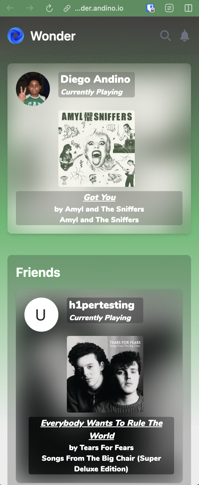
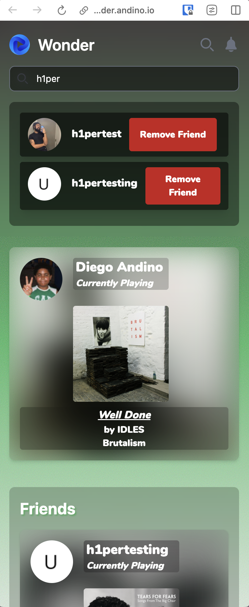

# Wonder

## A Spotify live feed music sharing app powered by Go, Echo, Templ and TailwindCSS

Since Spotify doesn't let you see what your friends are playing on the go, I created **Wonder**. **Wonder** lets anyone login with their Spotify account 
to be able to see what their friends are currently playing on Spotify. 

**Wonder** features:
- Fast and consistent live music feed from friends
- Searching, adding and removing friends
- Notification Manager
- Open and play any song from a friend on Spotify

  

## Note: Current db/ directory includes a test sqlite3 database for use of testing with the needed schema -- not a production database
